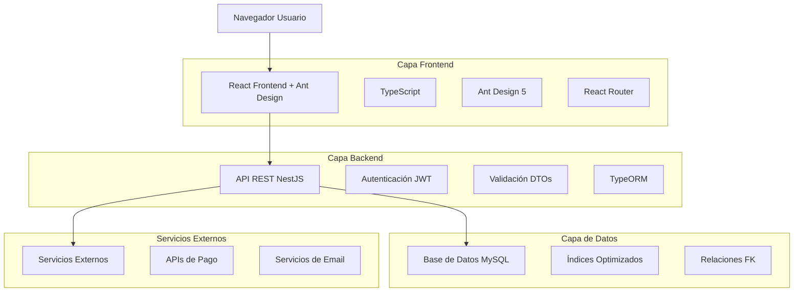
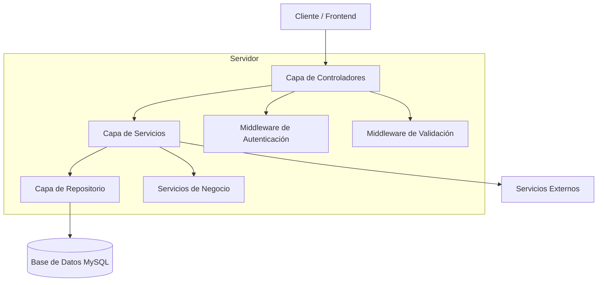
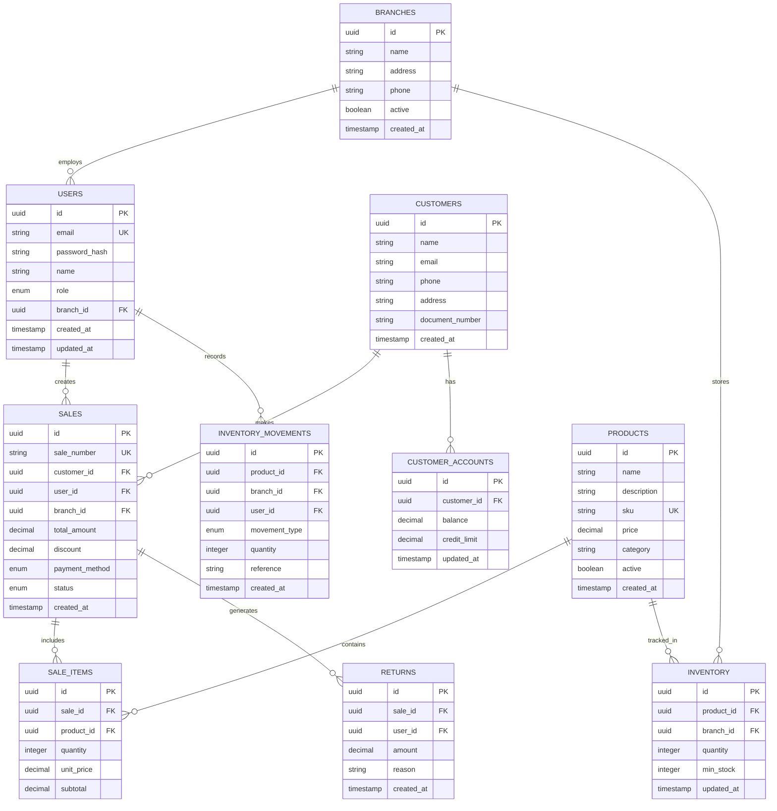

# Sistema Zarpar - Documento de Arquitectura Técnica

## 1. Diseño de Arquitectura



## 2. Descripción de Tecnologías

* **Frontend**: React\@18 + TypeScript\@5 + Ant Design\@5 + Vite\@4

* **Backend**: NestJS\@10 + TypeScript\@5 + TypeORM\@0.3

* **Base de Datos**: MySQL\@8.0

* **Autenticación**: JWT + Passport

* **Validación**: class-validator + class-transformer

## 3. Definiciones de Rutas

| Ruta                    | Propósito                                          |
| ----------------------- | -------------------------------------------------- |
| /                       | Dashboard principal con resumen de métricas        |
| /login                  | Página de autenticación de usuarios                |
| /pos                    | Punto de venta para procesamiento de transacciones |
| /inventory              | Gestión de inventario y stock                      |
| /inventory/log          | Bitácora de movimientos de inventario              |
| /inventory/transfer     | Transferencias entre sucursales                    |
| /products               | Catálogo y gestión de productos                    |
| /products/prices        | Lista y edición de precios                         |
| /sales                  | Historial y reportes de ventas                     |
| /sales/returns          | Gestión de devoluciones                            |
| /customers              | Base de datos de clientes                          |
| /customers/accounts     | Cuentas corrientes y créditos                      |
| /finance/cash           | Control de caja y efectivo                         |
| /finance/banks          | Gestión bancaria y conciliación                    |
| /finance/expenses       | Control de gastos operativos                       |
| /finance/payroll        | Gestión de sueldos y nómina                        |
| /finance/money-transfer | Envío de dinero y transferencias                   |
| /staff/sellers          | Gestión de vendedores                              |
| /admin/branches         | Administración de sucursales                       |

## 4. Definiciones de API

### 4.1 API Principal

**Autenticación de usuarios**

```
POST /api/auth/login
```

Request:

| Nombre Parámetro | Tipo   | Requerido | Descripción            |
| ---------------- | ------ | --------- | ---------------------- |
| email            | string | true      | Email del usuario      |
| password         | string | true      | Contraseña del usuario |

Response:

| Nombre Parámetro | Tipo   | Descripción                  |
| ---------------- | ------ | ---------------------------- |
| access\_token    | string | Token JWT para autenticación |
| user             | object | Información del usuario      |
| permissions      | array  | Permisos del usuario         |

Ejemplo:

```json
{
  "email": "admin@zarpar.com",
  "password": "password123"
}
```

**Gestión de productos**

```
GET /api/products
POST /api/products
PUT /api/products/:id
DELETE /api/products/:id
```

**Procesamiento de ventas**

```
POST /api/sales
GET /api/sales
GET /api/sales/:id
```

**Control de inventario**

```
GET /api/inventory
POST /api/inventory/movement
POST /api/inventory/transfer
```

**Gestión de clientes**

```
GET /api/customers
POST /api/customers
PUT /api/customers/:id
GET /api/customers/:id/account
```

## 5. Diagrama de Arquitectura del Servidor



## 6. Modelo de Datos

### 6.1 Definición del Modelo de Datos



### 6.2 Lenguaje de Definición de Datos

**Tabla de Usuarios (users)**

```sql
CREATE TABLE users (
    id CHAR(36) PRIMARY KEY DEFAULT (UUID()),
    email VARCHAR(255) UNIQUE NOT NULL,
    password_hash VARCHAR(255) NOT NULL,
    name VARCHAR(100) NOT NULL,
    role ENUM('admin', 'manager', 'seller', 'cashier') DEFAULT 'seller',
    branch_id CHAR(36),
    created_at TIMESTAMP DEFAULT CURRENT_TIMESTAMP,
    updated_at TIMESTAMP DEFAULT CURRENT_TIMESTAMP ON UPDATE CURRENT_TIMESTAMP,
    FOREIGN KEY (branch_id) REFERENCES branches(id)
);

CREATE INDEX idx_users_email ON users(email);
CREATE INDEX idx_users_branch ON users(branch_id);
```

**Tabla de Sucursales (branches)**

```sql
CREATE TABLE branches (
    id CHAR(36) PRIMARY KEY DEFAULT (UUID()),
    name VARCHAR(100) NOT NULL,
    address TEXT,
    phone VARCHAR(20),
    active BOOLEAN DEFAULT TRUE,
    created_at TIMESTAMP DEFAULT CURRENT_TIMESTAMP
);

INSERT INTO branches (name, address, phone) VALUES 
('Sucursal Principal', 'Av. Principal 123', '+1234567890'),
('Sucursal Norte', 'Calle Norte 456', '+1234567891');
```

**Tabla de Clientes (customers)**

```sql
CREATE TABLE customers (
    id CHAR(36) PRIMARY KEY DEFAULT (UUID()),
    name VARCHAR(100) NOT NULL,
    email VARCHAR(255),
    phone VARCHAR(20),
    address TEXT,
    document_number VARCHAR(50),
    created_at TIMESTAMP DEFAULT CURRENT_TIMESTAMP
);

CREATE INDEX idx_customers_document ON customers(document_number);
CREATE INDEX idx_customers_email ON customers(email);
```

**Tabla de Productos (products)**

```sql
CREATE TABLE products (
    id CHAR(36) PRIMARY KEY DEFAULT (UUID()),
    name VARCHAR(200) NOT NULL,
    description TEXT,
    sku VARCHAR(100) UNIQUE NOT NULL,
    price DECIMAL(10,2) NOT NULL,
    category VARCHAR(100),
    active BOOLEAN DEFAULT TRUE,
    created_at TIMESTAMP DEFAULT CURRENT_TIMESTAMP
);

CREATE INDEX idx_products_sku ON products(sku);
CREATE INDEX idx_products_category ON products(category);

INSERT INTO products (name, sku, price, category) VALUES 
('Producto Demo 1', 'DEMO001', 25.99, 'Electrónicos'),
('Producto Demo 2', 'DEMO002', 15.50, 'Hogar');
```

**Tabla de Inventario (inventory)**

```sql
CREATE TABLE inventory (
    id CHAR(36) PRIMARY KEY DEFAULT (UUID()),
    product_id CHAR(36) NOT NULL,
    branch_id CHAR(36) NOT NULL,
    quantity INTEGER DEFAULT 0,
    min_stock INTEGER DEFAULT 5,
    updated_at TIMESTAMP DEFAULT CURRENT_TIMESTAMP ON UPDATE CURRENT_TIMESTAMP,
    FOREIGN KEY (product_id) REFERENCES products(id),
    FOREIGN KEY (branch_id) REFERENCES branches(id),
    UNIQUE KEY unique_product_branch (product_id, branch_id)
);

CREATE INDEX idx_inventory_product ON inventory(product_id);
CREATE INDEX idx_inventory_branch ON inventory(branch_id);
```

**Tabla de Ventas (sales)**

```sql
CREATE TABLE sales (
    id CHAR(36) PRIMARY KEY DEFAULT (UUID()),
    sale_number VARCHAR(50) UNIQUE NOT NULL,
    customer_id CHAR(36),
    user_id CHAR(36) NOT NULL,
    branch_id CHAR(36) NOT NULL,
    total_amount DECIMAL(10,2) NOT NULL,
    discount DECIMAL(10,2) DEFAULT 0,
    payment_method ENUM('cash', 'card', 'transfer', 'credit') NOT NULL,
    status ENUM('pending', 'completed', 'cancelled') DEFAULT 'completed',
    created_at TIMESTAMP DEFAULT CURRENT_TIMESTAMP,
    FOREIGN KEY (customer_id) REFERENCES customers(id),
    FOREIGN KEY (user_id) REFERENCES users(id),
    FOREIGN KEY (branch_id) REFERENCES branches(id)
);

CREATE INDEX idx_sales_date ON sales(created_at);
CREATE INDEX idx_sales_user ON sales(user_id);
CREATE INDEX idx_sales_branch ON sales(branch_id);
```

**Tabla de Items de Venta (sale\_items)**

```sql
CREATE TABLE sale_items (
    id CHAR(36) PRIMARY KEY DEFAULT (UUID()),
    sale_id CHAR(36) NOT NULL,
    product_id CHAR(36) NOT NULL,
    quantity INTEGER NOT NULL,
    unit_price DECIMAL(10,2) NOT NULL,
    subtotal DECIMAL(10,2) NOT NULL,
    FOREIGN KEY (sale_id) REFERENCES sales(id) ON DELETE CASCADE,
    FOREIGN KEY (product_id) REFERENCES products(id)
);

CREATE INDEX idx_sale_items_sale ON sale_items(sale_id);
CREATE INDEX idx_sale_items_product ON sale_items(product_id);
```

**Tabla de Movimientos de Inventario (inventory\_movements)**

```sql
CREATE TABLE inventory_movements (
    id CHAR(36) PRIMARY KEY DEFAULT (UUID()),
    product_id CHAR(36) NOT NULL,
    branch_id CHAR(36) NOT NULL,
    user_id CHAR(36) NOT NULL,
    movement_type ENUM('in', 'out', 'transfer', 'adjustment') NOT NULL,
    quantity INTEGER NOT NULL,
    reference VARCHAR(255),
    created_at TIMESTAMP DEFAULT CURRENT_TIMESTAMP,
    FOREIGN KEY (product_id) REFERENCES products(id),
    FOREIGN KEY (branch_id) REFERENCES branches(id),
    FOREIGN KEY (user_id) REFERENCES users(id)
);

CREATE INDEX idx_movements_date ON inventory_movements(created_at);
CREATE INDEX idx_movements_product ON inventory_movements(product_id);
```

**Tabla de Cuentas de Clientes (customer\_accounts)**

```sql
CREATE TABLE customer_accounts (
    id CHAR(36) PRIMARY KEY DEFAULT (UUID()),
    customer_id CHAR(36) UNIQUE NOT NULL,
    balance DECIMAL(10,2) DEFAULT 0,
    credit_limit DECIMAL(10,2) DEFAULT 0,
    updated_at TIMESTAMP DEFAULT CURRENT_TIMESTAMP ON UPDATE CURRENT_TIMESTAMP,
    FOREIGN KEY (customer_id) REFERENCES customers(id)
);
```

**Tabla de Devoluciones (returns)**

```sql
CREATE TABLE returns (
    id CHAR(36) PRIMARY KEY DEFAULT (UUID()),
    sale_id CHAR(36) NOT NULL,
    user_id CHAR(36) NOT NULL,
    amount DECIMAL(10,2) NOT NULL,
    reason TEXT,
    created_at TIMESTAMP DEFAULT CURRENT_TIMESTAMP,
    FOREIGN KEY (sale_id) REFERENCES sales(id),
    FOREIGN KEY (user_id) REFERENCES users(id)
);

CREATE INDEX idx_returns_sale ON returns(sale_id);
CREATE INDEX idx_returns_date ON returns(created_at);
```

