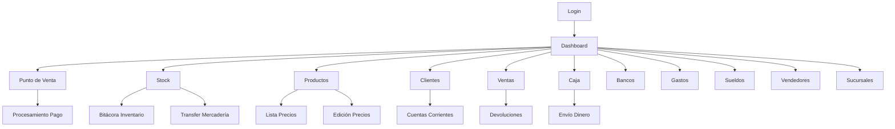

# Sistema Zarpar - Documento de Requisitos del Producto

## 1. Descripción General del Producto

Sistema Zarpar es una aplicación web integral de gestión empresarial que permite administrar todos los aspectos operativos de un negocio desde una interfaz moderna y responsiva.

El sistema resuelve la necesidad de centralizar la gestión de ventas, inventario, finanzas y recursos humanos en una sola plataforma, dirigido a pequeñas y medianas empresas que buscan digitalizar sus procesos.

Objetivo: Incrementar la eficiencia operativa y proporcionar visibilidad completa del negocio a través de un dashboard centralizado.

## 2. Características Principales

### 2.1 Roles de Usuario

| Rol | Método de Registro | Permisos Principales |
|-----|-------------------|---------------------|
| Administrador | Registro directo con credenciales maestras | Acceso completo a todos los módulos, gestión de usuarios |
| Gerente | Invitación por administrador | Acceso a reportes, ventas, inventario, finanzas |
| Vendedor | Invitación por gerente/administrador | Acceso a punto de venta, clientes, productos |
| Cajero | Invitación por gerente/administrador | Acceso a punto de venta, caja, devoluciones |

### 2.2 Módulos del Sistema

Nuestro sistema de gestión empresarial consta de las siguientes páginas principales:

1. **Dashboard Principal**: panel de control central, navegación a módulos, resumen de métricas clave
2. **Punto de Venta**: procesamiento de ventas, selección de productos, métodos de pago
3. **Gestión de Inventario**: control de stock, bitácora de movimientos, transferencias entre sucursales
4. **Gestión Financiera**: caja, bancos, gastos, sueldos, envío de dinero
5. **Gestión Comercial**: ventas, devoluciones, cuentas corrientes, clientes
6. **Administración**: productos, vendedores, precios, sucursales
7. **Autenticación**: login y registro de usuarios

### 2.3 Detalles de Páginas

| Página | Módulo | Descripción de Funcionalidades |
|--------|--------|---------------------------------|
| Dashboard Principal | Panel Central | Mostrar métricas clave, acceso rápido a módulos, notificaciones importantes |
| Punto de Venta | Procesamiento Ventas | Buscar productos, agregar al carrito, aplicar descuentos, procesar pagos |
| Stock | Control Inventario | Ver niveles de stock, alertas de stock bajo, historial de movimientos |
| Bitácora Inventario | Seguimiento Movimientos | Registrar entradas/salidas, transferencias, ajustes de inventario |
| Transfer Mercadería | Gestión Transferencias | Crear transferencias entre sucursales, seguimiento de envíos |
| Productos | Catálogo Productos | Crear/editar productos, categorías, precios, imágenes |
| Ventas | Historial Ventas | Ver ventas realizadas, filtros por fecha/vendedor, reportes |
| Devoluciones | Gestión Devoluciones | Procesar devoluciones, reintegros, ajustes de inventario |
| Clientes | Base Clientes | Gestionar información de clientes, historial de compras |
| Cuentas Corrientes | Créditos Clientes | Gestionar créditos, pagos pendientes, estados de cuenta |
| Caja | Control Efectivo | Apertura/cierre de caja, movimientos de efectivo, arqueos |
| Bancos | Gestión Bancaria | Conciliación bancaria, transferencias, movimientos |
| Gastos | Control Gastos | Registrar gastos operativos, categorización, reportes |
| Sueldos | Gestión RRHH | Calcular sueldos, descuentos, reportes de nómina |
| Envío Dinero | Transferencias | Gestionar envíos de dinero, comisiones, seguimiento |
| Vendedores | Gestión Personal | Administrar vendedores, comisiones, metas de venta |
| Lista Precios | Gestión Precios | Crear listas de precios, descuentos por cliente/producto |
| Edición Precios | Actualización Precios | Modificar precios masivamente, historial de cambios |
| Sucursales | Gestión Sucursales | Administrar múltiples sucursales, configuraciones |
| Login | Autenticación | Iniciar sesión con email/usuario y contraseña |
| Registro | Creación Cuenta | Registrar nuevos usuarios según rol asignado |

## 3. Proceso Principal

**Flujo del Administrador:**
1. Login → Dashboard → Configuración inicial de sucursales y productos
2. Creación de usuarios (gerentes, vendedores, cajeros)
3. Configuración de precios y listas
4. Monitoreo de operaciones a través del dashboard

**Flujo del Vendedor:**
1. Login → Dashboard → Punto de Venta
2. Búsqueda y selección de productos
3. Procesamiento de venta y pago
4. Gestión de clientes y cuentas corrientes

**Flujo del Cajero:**
1. Login → Apertura de caja
2. Procesamiento de ventas y devoluciones
3. Control de efectivo y cierre de caja

## 4. Diseño de Interfaz de Usuario

### 4.1 Estilo de Diseño

- **Colores primarios**: Azul (#1890ff), Verde (#52c41a) para acciones positivas
- **Colores secundarios**: Gris (#f0f2f5) para fondos, Rojo (#ff4d4f) para alertas
- **Estilo de botones**: Redondeados con sombras suaves, efectos hover
- **Tipografía**: Inter o system fonts, tamaños 14px (texto), 16px (botones), 24px (títulos)
- **Layout**: Diseño de tarjetas con espaciado generoso, navegación lateral colapsible
- **Iconos**: Ant Design Icons con colores vibrantes y efectos de gradiente

### 4.2 Resumen de Diseño de Páginas

| Página | Módulo | Elementos UI |
|--------|--------|--------------|
| Dashboard | Panel Central | Grid de tarjetas coloridas 4x5, iconos grandes con gradientes, métricas en tiempo real |
| Punto de Venta | Interface Venta | Layout de 2 columnas, lista productos izquierda, carrito derecha, botones grandes |
| Stock | Control Inventario | Tabla con filtros, badges de estado, gráficos de barras para niveles |
| Productos | Gestión Catálogo | Cards con imágenes, modal de edición, drag & drop para categorías |
| Ventas | Historial | Tabla con paginación, filtros de fecha, gráficos de tendencias |
| Caja | Control Efectivo | Interface tipo calculadora, resumen visual de movimientos |
| Clientes | Base Datos | Lista con avatars, búsqueda instantánea, perfil detallado |

### 4.3 Responsividad

Diseño mobile-first con breakpoints:
- Mobile: < 768px (navegación hamburguesa, cards apiladas)
- Tablet: 768px - 1024px (grid 2x2, sidebar colapsible)
- Desktop: > 1024px (grid completo 4x5, sidebar fijo)

Optimización táctil para dispositivos móviles con botones de mínimo 44px de altura.